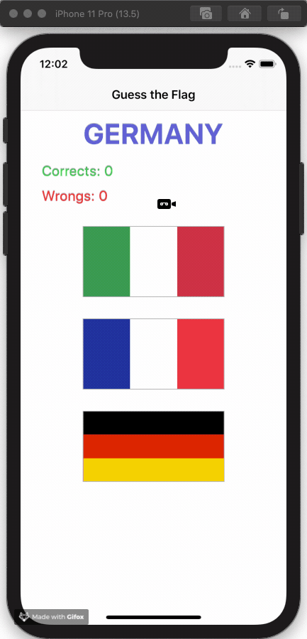
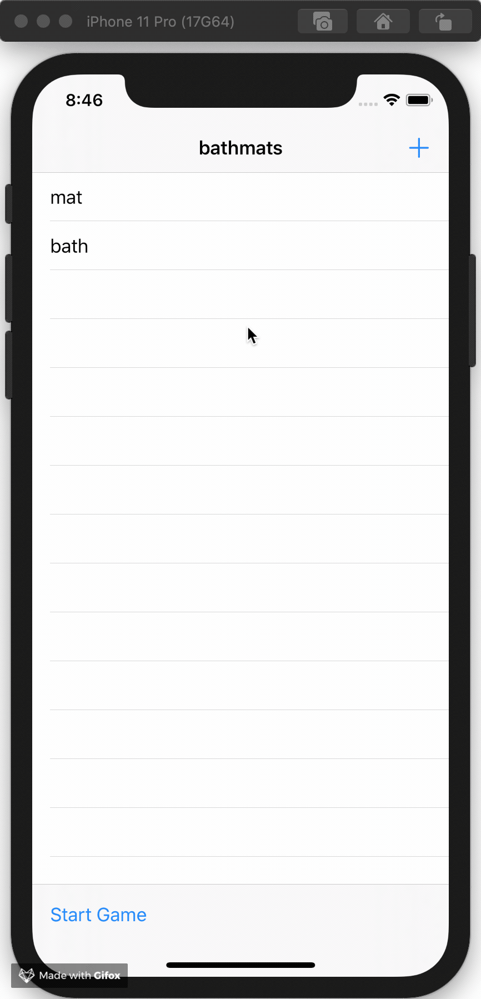

# 100DaysOfSwift
https://www.hackingwithswift.com/100

| Project 1                                  | Project 2                                  | Project 3                                  |
|--------------------------------------------|--------------------------------------------|--------------------------------------------|
||||

| Challenge 01                                 | Project 4                                  | Project 5                                  |
|----------------------------------------------|--------------------------------------------|--------------------------------------------|
||||

| Project 6 A                                 | Project 6 B                                 |
|---------------------------------------------|---------------------------------------------|
|||

| Challenge 02                                 |
|----------------------------------------------|
||

Currently code on the day 33 - Parsing JSON using the Codable protocol
